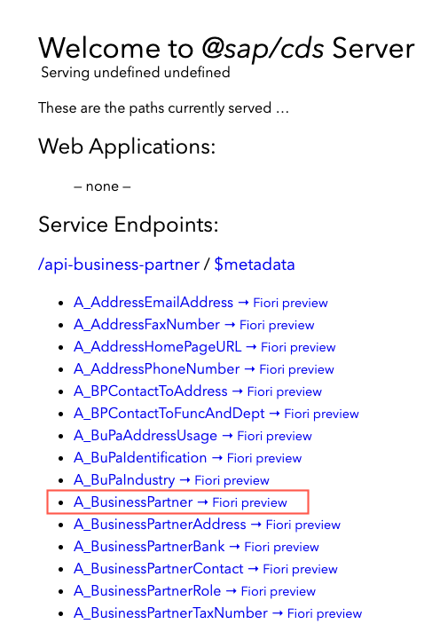

# Exercise 1 - Integrate a Service from SAP S/4HANA Cloud

In this exercise, we will integrate the _Business Partner Service_ from SAP S/4HANA Cloud into the _Incidents Management_ application.

## Import the service definition

SAP publishes service definitions for its major products on SAP API Business Hub. These service definitions are required to use remote services in CAP. For example, to call a remote service, build projections upon them, and to mesh-up with them.

To download the [Business Partner API (A2X) from SAP S/4HANA Cloud](https://api.sap.com/api/API_BUSINESS_PARTNER/overview), go to section _API Resources_, select _API Specification_, and download the _EDMX_ file.

## Add the Business Partner service to your project

From your project's root folder, run the `cds import` command with the path of your downloaded `API_BUSSINESS_PARTNER.edmx` file.

```sh
cds import <DownloadPath>/API_BUSINESS_PARTNER.edmx
```

Output:
```
[cds] - imported API to srv/external/API_BUSINESS_PARTNER.csn
> use it in your CDS models through the like of:

using { API_BUSINESS_PARTNER as external } from './external/API_BUSINESS_PARTNER';

[cds] - updated ./package.json
```

Behind the scenes, the command has copied the `EDMX` file to the `srv/external` folder of your project and convert it to CAP's format [CSN](https://cap.cloud.sap/docs/cds/csn), which will be placed there as well (`srv/external/API_BUSINESS_PARTNER.csn`).

Additionally, the file is registered as service definition in the package.json file:
```jsonc
"cds": {
  "requires": {
      ...
      "API_BUSINESS_PARTNER": {
      "kind": "odata-v2",
      "model": "srv/external/API_BUSINESS_PARTNER"
    }
```

## Run with service mocks

Check the output of `cds watch` in your terminal.  You find the information about what's going on:

```
...
> init from ./srv/external/data/API_BUSINESS_PARTNER-A_BusinessPartner.csv
...
[cds] - mocking API_BUSINESS_PARTNER { at: '/api-business-partner' }
[cds] - serving IncidentsService { path: '/incidents' }
```

You see that
- The external `API_BUSINESS_PARTNER` is mocked.  This is because the service isn't connected to a real remote data source
- There is a csv file with mock data for convenient testing.


Open the CAP application in your browser: http://localhost:4004/.
You can now see the `api-business-partner` service with all its entities under _Service Endpoints_.




## Integrate the external data model

Create a file `srv/mashup.cds`, where you add the next snippets one by one.

First, some imports:

```cds
using { API_BUSINESS_PARTNER as S4 } from './external/API_BUSINESS_PARTNER';
using { acme.incmgt, IncidentsService } from './incidents-service';

namespace acme.incmgt;
```

#### Add `Customers` projection

For this application, you need only a few fields from the `A_BusinessPartner` entity. To do this, you create a _projection_ on the external service. Since in this example, you are only interested in the business partners that are customers, you use the name `Customers` for your projection.


```cds
using { API_BUSINESS_PARTNER as S4 } from './external/API_BUSINESS_PARTNER';
using { acme.incmgt, IncidentsService } from './incidents-service';

namespace acme.incmgt;

entity Customers as projection on S4.A_BusinessPartner {
  key BusinessPartner as ID,
  BusinessPartnerFullName as name,
}
```

#### Expose `Customers` in service

```cds
extend service IncidentsService with {
  entity Customers as projection on incmgt.Customers;
}
```

#### Connect it to `Incidents`

```cds
extend incmgt.Incidents with {
  customer : Association to incmgt.Customers;
}
```

#### Add local cache

We want to display the remote customer data in Incidents lists.  We better have this data cached for fast access.
Add a local persistency to do this.  The annotation `@cds.persistence: {table,skip:false}` turns the view above into a table with the same signature (`ID` and `name` columns).

```cds
annotate Customers with @cds.persistence: {table,skip:false};
```

## Write the handler code

In file `srv/incidents-service.js`, add the following snippets one by one.

#### Delegate calls to remote system

To make the value help for `Customers` work, we need to redirect the request to the remote system (or our mock).
Otherwise, the framework would read it from our cache table, which may not hold the data yet.

```js
const cds = require ('@sap/cds')
module.exports = cds.service.impl(async function() {
  const S4bupa = await cds.connect.to('API_BUSINESS_PARTNER');

  // Delegate Value Help reads for Customers to S4 backend
  this.on ('READ', 'Customers', req => {
    req.query.where({ IsNaturalPerson:'X' }) // additional filter condition
    console.log ('>> delegating to S4 service...')
    return S4bupa.run(req.query)
  })
})
```

#### Replicate data

To make the caching work, replicate customer data every time an `Incidents` record with customer data is updated.

```js
const db = await cds.connect.to('db')     // our primary database
const { Customers }  = db.entities        // CDS definition of the Customers entity

this.after (['CREATE','UPDATE'], 'Incidents', async (data, req) => {
  const { customer_ID: ID } = data
  if (ID) {
    let replicated = await db.exists (Customers,ID)
    console.log ('>> Updating customer', ID, replicated ? '(already replicated)' : '(not) replicated')
    if (!replicated) { // initially replicate Customers info
      let customer = await S4bupa.read (Customers,ID)
      await INSERT(customer) .into (Customers)
    }
  }
})
```

### Verify in UI

- Open [Fiori preview for the `Incidents` entity](http://localhost:4004/$fiori-preview/IncidentsService/Incidents#preview-app).
- Create a new Incident and select a customer using the value help.  When pressing _Save_, watch the console ouput of the application and see the `>> Updating customer ... replicated` message.

### Optional: Verify in a rest client

With the [Rest client for VS Code](https://marketplace.visualstudio.com/items?itemName=humao.rest-client), you can conveniently test this flow without the UI.

Create a file `tests.http`:

```http
###
# @name IncidentsCreate

POST http://localhost:4004/incidents/Incidents
Authorization: Basic carol:
Content-Type: application/json

{
  "title": "New incident",
  "customer_ID": "9980002023"
}


###
@id = {{IncidentsCreate.response.body.$.ID}}

POST http://localhost:4004/incidents/Incidents(ID={{id}},IsActiveEntity=false)/draftActivate
Authorization: Basic carol:
Content-Type: application/json
```

- Click `Send Request` above the `POST .../Incidents` line.  This will create the record in a draft state.
- Click `Send Request` above the `POST .../draftActivate` line.  This corresponds to the `Save` action in the UI.

You should see the same server log.

### Optional: Improve the error handling

Execute the above requests with a customer ID that does not exist (like `XXX`).
- What error do you get?
- Can you improve the error handling such that the client gets a `404` error instead, including a proper error message?  See the [documentation](https://cap.cloud.sap/docs/node.js/events#req-reject).


<details>
<summary>See the solution</summary>

Make sure to turn the `502` error into a _client_ error like `404`:

```js
if (!replicated) {
  let customer
  try {
    customer = await S4bupa.read (Customers,ID)
  } catch (e) {
    return req.reject(404, 'No such customer: ' + ID, 'customer_ID')
  }
  await INSERT(customer) .into (Customers)
}
```
</details>

## Summary

You've now learned how to integrate a remote service step by step.

In the next [exercise 2](../ex2/README.md), you will package this implementation such that it could be used as an integration package by other applications.
